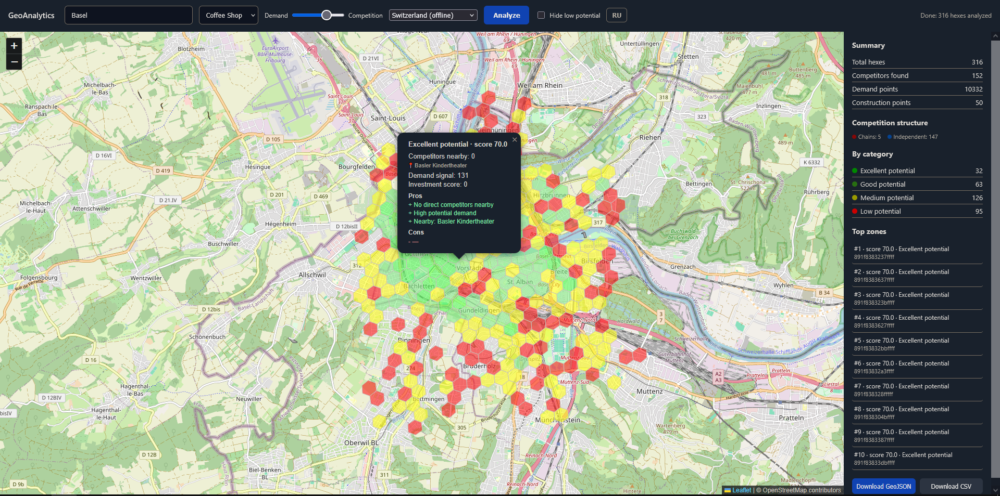

# GeoAnalytics

Location intelligence engine for small-business site selection. The project aggregates OpenStreetMap points of interest into H3 hex grids, scores each zone by demand vs. competition, and visualizes opportunities on an interactive map.

Built as a C++23 backend with a lightweight web UI — suitable as a portfolio piece demonstrating geospatial data pipelines, API design, and practical analytics.



## Highlights

- **H3 hex aggregation** at configurable resolution (default: 9)
- **Opportunity scoring**: demand weight vs. competitor penalty, adjustable in the UI
- **Growth signal**: construction / development activity as an investment indicator
- **Chain vs. independent segmentation**: competitor breakdown with visual bar in the map popup and sidebar
- **EN / RU interface**: language toggle in the top bar, switches instantly without reload
- **Top zones navigation**: click any top-10 zone in the sidebar to fly to it on the map
- **Dual data sources**: live Overpass API or offline `.osm.pbf` extracts via Osmium
- **REST API** + embedded map UI (Leaflet)
- **Unit tests** with Catch2

## Architecture

```text
Web UI (Leaflet)  →  HTTP API (httplib)  →  Analytics core
                              ↓
                    OSM / PBF data sources
                              ↓
                     H3 grid + scoring
                              ↓
                     GeoJSON + summary JSON
```

| Component | Role |
|-----------|------|
| `GeoAnalyticsServer` | HTTP server, serves UI and `/analyze` |
| `GeoAnalytics` | CLI batch pipeline (CSV or city/business mode) |
| `GeoAnalyticsCore` | Shared library: H3, scoring, I/O, geo sources |

## Requirements

- Windows 10+ (primary dev environment)
- CMake 3.21+
- MSVC with C++23
- [vcpkg](https://vcpkg.io/) packages: `h3`, `spdlog`, `nlohmann-json`, `cpr`, `httplib`, `sqlite3`, `catch2`
- **Osmium Tool** on `PATH` for offline PBF mode ([install guide](https://osmcode.org/osmium-tool/))

## Build

```powershell
cd project
cmake --preset default
cmake --build out/build/default
ctest --test-dir out/build/default
```

## Run

### Server + map UI

```powershell
cd project/out/build/default
.\GeoAnalyticsServer.exe
```

Open [http://127.0.0.1:8080/](http://127.0.0.1:8080/) if the browser does not launch automatically.

1. Enter a city (e.g. `Tbilisi`)
2. Choose business type and data source
3. Click **Analyze**

### CLI

```powershell
.\GeoAnalytics.exe --city Tbilisi --business coffee_shop
```

## Configuration

| File | Purpose |
|------|---------|
| `config/app.json` | Scoring weights, paths, H3 resolution |
| `config/pbf_sources.json` | Offline PBF files and country codes |

Example PBF entry:

```json
{
  "georgia": {
    "path": "data/pbf/georgia-latest.osm.pbf",
    "country_code": "ge"
  }
}
```

Download regional extracts from [Geofabrik](https://download.geofabrik.de/).

## API

| Endpoint | Description |
|----------|-------------|
| `GET /` | Web UI |
| `GET /health` | Health check |
| `GET /pbf-sources` | List configured offline sources |
| `GET /analyze?city=&business=&source=&demand_weight=&competitor_weight=` | Run analysis |
| `GET /analyze?...&demand_weight=&competitor_weight=` | Adjustable scoring weights (0.0–1.0) |

## Logging & troubleshooting

Logs are written to:

- `logs/server.log` — API server
- `logs/cli.log` — CLI runs

If the console closes unexpectedly, check the log file first. The process now waits for **Enter** before exiting so error messages remain visible.

Common issues:

| Symptom | Likely cause |
|---------|--------------|
| Console closes instantly | Fatal crash — see `logs/server.log` |
| "Could not connect to server" | `GeoAnalyticsServer.exe` is not running |
| PBF analysis fails | Osmium not installed or wrong working directory |
| City/country mismatch | Selected offline PBF does not cover the geocoded city |

## Business types

| Key | Competitors | Demand proxies |
|-----|-------------|----------------|
| `coffee_shop` | cafes | offices, residential, bus stops, building levels |
| `barbershop` | hairdressers, barbers | residential, bus stops |

## Tech stack

C++23 · H3 · SQLite · spdlog · nlohmann/json · cpr · cpp-httplib · Catch2 · Leaflet · OpenStreetMap

## License

Educational / portfolio project. OpenStreetMap data © OpenStreetMap contributors (ODbL).
